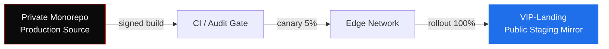

<div align="center">

# **VIP-Landing**
### Cinematic Conversion Engine — Edge-Deployed.

*Frame-perfect landing surfaces engineered for asymmetric conversion.*


</div>

---

## Overview

A high-performance, GPU-accelerated landing layer built for premium product launches, VIP campaigns, and conversion-critical surfaces. Every frame is choreographed. Every byte is interrogated.

This public repository is a **staging mirror** — a sanitized build artifact used for edge CDN validation, Lighthouse audits, and deployment infrastructure checks. The production source — proprietary WebGL shaders, 3D asset pipelines, GSAP timeline orchestration, and the cinematic motion system — lives in a private monorepo under restricted access.

> No production code ships through this surface. This is the showcase, not the engine room.

---

## Architecture



Access to the private monorepo requires NDA + internal approval.

---

## Stack

| Layer | Technology |
|---|---|
| **Framework** | Next.js (App Router · RSC · Edge runtime) |
| **Motion** | GSAP 3 · ScrollTrigger · custom timeline orchestration |
| **3D / WebGL** | Three.js · React Three Fiber · custom GLSL shaders |
| **Styling** | TailwindCSS · design-token system · variable fonts |
| **Performance** | GPU compositing · lazy 3D loading · subpixel rendering |
| **Delivery** | Edge CDN · streaming SSR · ISR · signed artifacts |

---

## Performance Budget

Non-negotiable. Anything below these thresholds is rejected at the deploy gate.

| Metric | Target |
|---|---|
| LCP | `< 1.2s` |
| FID / INP | `< 50ms` |
| CLS | `< 0.02` |
| TTI (4G) | `< 2.0s` |
| TTFB (edge) | `< 80ms` |
| Lighthouse | `95+` across all categories |

---

## Design Principles

1. **Cinema over decoration.** Motion serves narrative, never noise.
2. **Performance is the design.** A beautiful page that lags is a failure.
3. **Asymmetric experiences for asymmetric intent.** This is not a brochure.
4. **Edge-first.** TTFB measured in milliseconds, not seconds.
5. **Restraint at speed.** 60fps is the floor, not the ceiling.

---

## Deployment

Fully automated. No manual pushes. No exceptions.

```
build  →  audit  →  canary (5%)  →  edge rollout (100%)
```

Every artifact is content-hashed, signed, and immutable.

---

## Access

- **Public staging mirror:** read-only.
- **Production source:** restricted. NDA + internal approval required.
- **Security disclosures:** private channel only.

---

<div align="center">

**Proprietary · All Rights Reserved**

</div>
